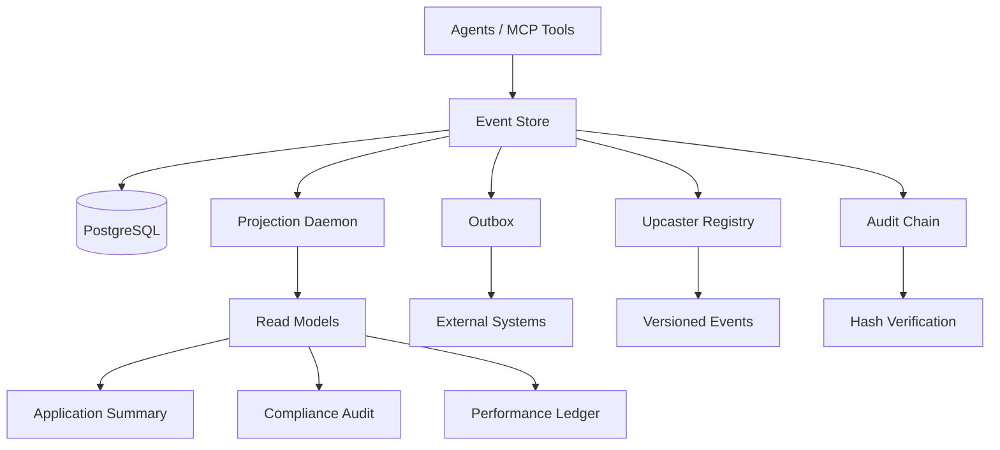

# 🚀 The Ledger — Agentic Event Store & Audit Infrastructure


---

## 📌 Overview

**The Ledger** is a production-grade **event sourcing infrastructure** designed for **multi-agent AI systems**.

It transforms ephemeral agent actions into a **persistent, immutable, and auditable system of record**, enabling:

- 🧾 Complete decision traceability  
- 🔁 Replayable system state  
- 🔍 Temporal queries ("what happened at time T?")  
- 🔐 Cryptographic audit integrity  

---

## 🎯 Problem It Solves

Traditional AI systems:
- Lose execution history  
- Lack auditability  
- Cannot guarantee correctness under concurrency  

**The Ledger solves this by:**
- Storing all actions as immutable events  
- Enforcing concurrency control  
- Providing a full audit trail for compliance  

---

## 🧱 Architecture Overview



---

# ✨ Key Features

## 🚀 Phase 1: Event Store Core
- **PostgreSQL-Backed Storage**: Append-only events table with stream metadata  
- **Optimistic Concurrency Control**: Version-based conflict detection (`expected_version`)  
- **Outbox Pattern**: Guaranteed event delivery for downstream systems  
- **Double-Decision Test**: Validated concurrency under parallel load  

## 🧠 Phase 2: Domain Logic
- **Aggregates**: `LoanApplication`, `AgentSession`, `ComplianceRecord`  
- **Business Rules**: State machine enforcement, confidence thresholds, compliance dependencies  
- **Gas Town Pattern**: Crash-safe agent memory reconstruction  

## ⚙️ Phase 3: Projections & CQRS
- **Async Daemon**: Background processing with checkpoint coordination  
- **Read Models**:
  - `ApplicationSummary`
  - `AgentPerformanceLedger`
  - `ComplianceAuditView`  
- **Temporal Queries**: Reconstruct past system states  

## 🔐 Phase 4: Integrity & Evolution
- **Upcasting**: Schema evolution without mutating historical data  
- **Cryptographic Audit Chain**: Tamper detection via hash chaining  

## 🔌 Phase 5: MCP Interface
- **Tools (Commands)**:
  - `submit_application`
  - `record_credit_analysis`
  - *(+6 more)*  
- **Resources (Queries)**:
  - `ledger://applications/{id}/compliance`  
- **Structured Errors**: Typed responses for agent recovery  

---

# 🛠 Quick Start

## 📌 Prerequisites
- Python **3.11+**
- PostgreSQL **16+**
- Package Manager: `uv` or `pip`

---

## 1️⃣ Clone & Install
```bash
git clone <repo-url>
cd ledger_infrastructure
uv pip install -r requirements.txt
```

## 2️⃣ Database Setup
```bash
createdb ledger_db
psql -d ledger_db -f db/schema.sql
```

## 3️⃣ Configuration
```bash
cp .env.example .env
# Update credentials
```

## 4️⃣ Run Tests
```bash
pytest tests/
```

## 5️⃣ Start Services
```bash
python -m src.main
```

---

# 📂 Project Structure

```text
ledger_infrastructure/
├── db/
│   └── schema.sql
├── src/
│   ├── store/
│   ├── domain/
│   ├── projections/
│   ├── integrity/
│   └── mcp/
├── tests/
├── .env.example
├── requirements.txt
└── README.md
```

---

# 🧪 Testing Strategy

## ✅ Double-Decision Concurrency Test
Ensures only one agent can append to a stream at a time.

```bash
pytest tests/test_concurrency.py
```

**Expected Result:**
- ✅ One success  
- ❌ One `OptimisticConcurrencyError`  

---

## 🔍 Immutability Test
Validates that historical events are never modified.

```bash
pytest tests/test_upcasting.py
```

---

## 🔗 MCP Integration Test
End-to-end system validation via MCP tools.

```bash
pytest tests/test_mcp.py
```

---

# 📚 Documentation

| Document | Description |
|--------|------------|
| `DOMAIN_NOTES.md` | Conceptual mastery (EDA vs Event Sourcing) |
| `DESIGN.md` | Architecture, tradeoffs, SLOs |
| `schema.sql` | Database contract |

---

# 🔒 Security

- ❗ Never commit `.env`
- 🔐 Use secrets managers in production:
  - AWS Secrets Manager  
  - HashiCorp Vault  
- 🔍 Encrypt audit logs (PII)
- 🔁 Rotate exposed credentials immediately  

---

# 🛣 Roadmap

| Phase | Status | Completion |
|------|--------|------------|
| Phase 0 | ✅ Complete | 100% |
| Phase 1 | ✅ Complete | 100% |
| Phase 2 | ✅ Complete | 100% |
| Phase 3 | 🟡 In Progress | 60% |
| Phase 4 | 🟡 In Progress | 40% |
| Phase 5 | 🔴 Pending | 0% |

---

# 🤝 Contributing

```bash
git checkout -b feature/new-feature
git commit -m "Add feature"
git push origin feature/new-feature
```

Then open a Pull Request.

> All contributions must include tests.

---

# 📄 License

MIT License — see `LICENSE`

---

# 🙏 Acknowledgments

- TRP1 —  
- Apex Financial Services  
- Marten / EventStoreDB  
- Model Context Protocol (MCP)  

---

# 🏁 Final Thought

> "Events are not logs. They are the system of record."

The Ledger enables **auditable, reliable, and scalable AI systems** — where every decision is traceable, verifiable, and reproducible.

---

## 👨‍💻 Author

**Addisu Taye**  
 